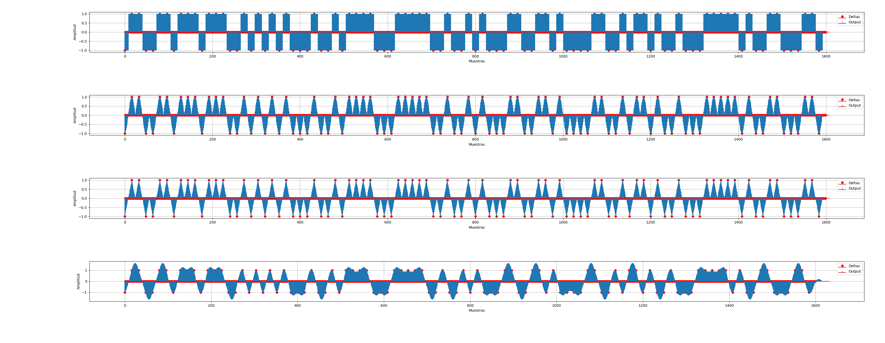
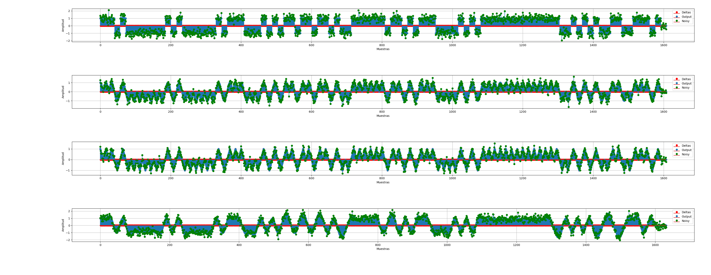
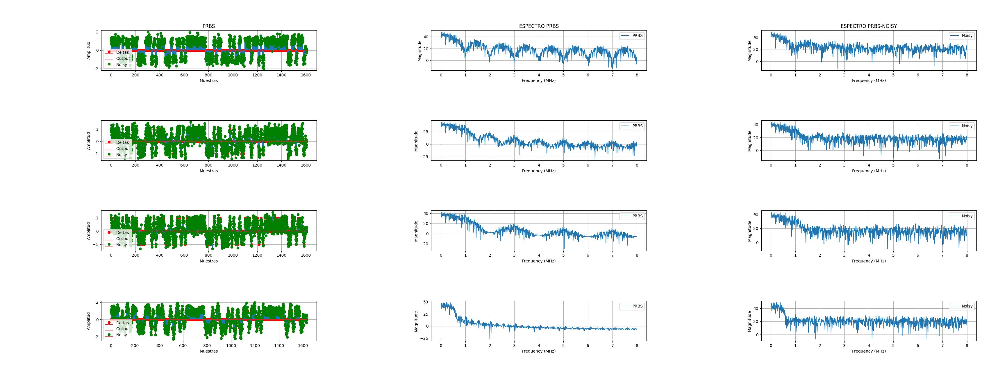

# Entrega ejercicio 3

### La siguiente figura muestra la señal PRBS. La señal de deltas se puede ver con un punto rojo. La señal convolucionada con el simbolo se puede ver lineas azules.

### La siguiente figura muestra la señal PRBS con ruido de 10dB sumada en verde.

### La siguiente figura muestra la señal PRBS con la densidad espectral de la señal PRBS sin ruido (figuras del medio) y PRBS con ruido (figura de la derecha).
